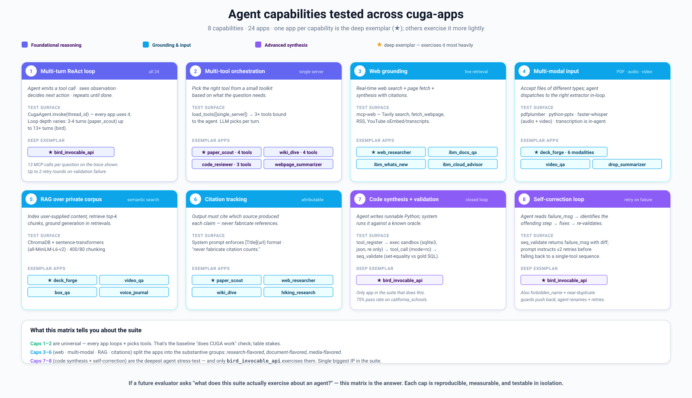
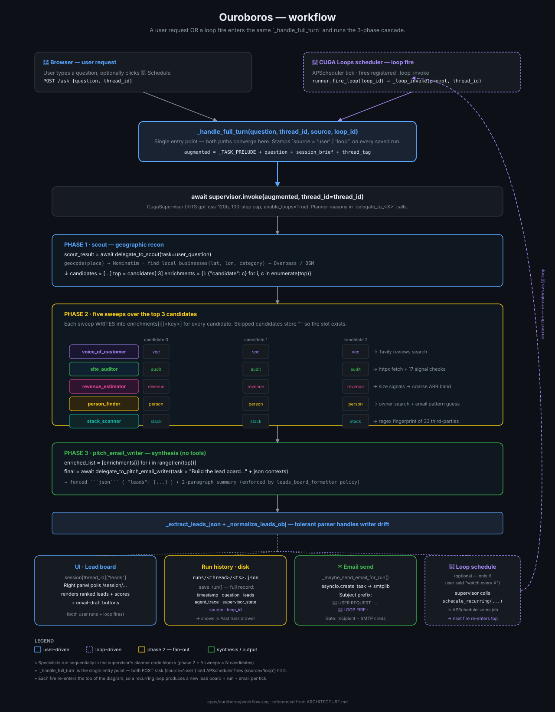

# Build real agentic apps on CUGA: two dozen working examples on a lightweight agent harness

> **TL;DR** — If you've built agents before, you know the hard part isn't the
> model. It's wiring up tools, holding state together across a long workflow,
> adding guardrails, and scaling from one agent to several without a rewrite.
> [CUGA](https://cuga.dev) (`pip install cuga`) is a lightweight, open-source
> agent harness that handles those concerns while staying easy to configure. To
> show what that feels like in practice, we built **CUGA Apps**: two dozen
> working examples that double as copy-and-edit templates for real agentic
> applications. This is the developer tour.

---

## What is CUGA?

CUGA — short for **Configurable Generalist Agent** — is an open-source agent
harness from IBM Research, and it lives at [cuga.dev](https://cuga.dev).
"Harness" is the right word, more so than "framework": it's the runtime that
handles the unglamorous orchestration around a model — planning a task out,
calling tools, writing and running code, keeping intermediate state straight,
retrying when something fails — so you're not reassembling that same machinery
every time you build a new agent.

The idea in the name is that you start from a strong generalist and narrow it to
your domain: give it your tools, your procedure, your guardrails. The same
harness runs as a single-file app on your laptop and as a self-hosted, governed
deployment in production — it's the engine behind [IBM's Sovereign Core](https://www.ibm.com/docs/en/sovereign-core/1.0.0?topic=services-ai-agent-types) agentic
experience, and just as content powering a weekend project. The rest of this
post is what that looks like from a developer's seat.

## What you stop having to build

The honest question to ask of any agent framework is: what does this save me
from writing myself? With CUGA the list runs long. The API you actually touch is
small — `CugaAgent(tools=[...])`, then `await agent.invoke(msg)` — but each of
the things below is something you'd otherwise be building and maintaining on your
own.

- **Connecting tools.** OpenAPI specs, MCP servers, and plain LangChain
  functions are all first-class, and the agent treats them as interchangeable. A
  REST API, a custom MCP server, and a Python function bind the same way, so
  there are no one-off adapters to write.
- **Keeping a long task coherent.** CUGA plans before it acts and executes with a
  mix of tool calls and generated code (CodeAct). The piece that really matters
  on long horizons is *variable management*: it holds onto intermediate results
  rather than re-deriving (and re-hallucinating) them every turn, and a
  reflection step lets it catch a bad call and re-plan instead of barrelling
  ahead. That's the machinery behind landing **#1 on
  [AppWorld](https://appworld.dev/)** (750 tasks across 457 APIs) and **#1 on
  [WebArena](https://webarena.dev/)** from February to September 2025. You don't
  end up hand-rolling a state machine, or a retry loop, to hold a 20-step task
  together.
- **Guardrails.** Five policy types — Intent Guard, Playbook, Tool Approval, Tool
  Guide, Output Formatter — plus human-in-the-loop approval gates, all
  declarative. The safety logic lives in one place instead of leaking into every
  request handler.
- **Going multi-agent.** Any agent can be handed to another agent as a tool. A
  `CugaSupervisor` delegates to specialists (including external **A2A** agents),
  so growing from one agent to a small team means adding a specialist, not
  adopting a new framework.
- **Trading speed for precision.** Fast, Balanced, and Accurate reasoning modes,
  with code execution in whatever sandbox you trust (local, Docker/Podman, or E2B
  cloud). You dial cost and latency from config, not code.
- **Grounding on your own documents.** A built-in knowledge engine —
  Docling-powered RAG over PDFs, Office files, HTML, and Markdown, at agent or
  session scope — so simple grounding doesn't mean standing up a separate vector
  pipeline.
- **Speeding up repeat work.** Save-and-reuse (still experimental) captures a
  successful run and replays the path next time, for quicker and steadier
  behaviour.
- **Staying portable.** `pip install cuga`, switch LLM providers with one env var
  (OpenAI, watsonx, Azure, Groq, OpenRouter, Ollama, LiteLLM), and self-host on
  your own Kubernetes via Helm when you're ready.

The first word of the name carries the whole idea: it's a *Configurable*
Generalist Agent. Not a finished product you adopt wholesale, and not a black box
either — more a strong default you bend toward your own problem. You point it at
your tools, write the procedure into the system prompt, set whatever policies you
care about, and ship. The hard parts above are already handled; your job is the
task. The rest of this post is about what "the task" actually looks like, using
apps you can clone today.

## CUGA Apps: a place to start

You can't really feel "configurable" from a README, so we built **CUGA Apps**
instead: two dozen small, runnable apps. Each one is the same short list of
parts — a `CugaAgent`, a tool list, a system prompt — wrapped in a FastAPI server
with a live panel that shows the agent's state as it works.

They're worth a few minutes just to click through: tool composition, stateful
tools, procedural planning, governance, all on tasks concrete enough to poke at.
And each app leans on one capability in particular, so together they end up
mapping what the framework can actually do:



Think of it as a learning path: each capability has one app that leans on it
hardest — the **deep exemplar** — which is the one to open and read.

1. **Multi-turn ReAct loop** — emit a tool call, read the observation, decide the
   next move, repeat. Universal (all two dozen apps); pushed hardest by
   `bird_invocable_api` at 13 tool calls per question.
2. **Multi-tool orchestration** — pick the right tool from a small toolkit per
   turn. Exemplars: `paper_scout`, `wiki_dive`, `code_reviewer`.
3. **Web grounding** — live search + page fetch + synthesis. Exemplars:
   `web_researcher`, `ibm_docs_qa`.
4. **Multi-modal input** — accept PDFs, audio, video and dispatch to the right
   extractor in-loop. Exemplars: `deck_forge` (6 modalities), `video_qa`,
   `drop_summarizer`.
5. **RAG over a private corpus** — index user content, retrieve top-k, ground the
   answer. Exemplars: `deck_forge`, `video_qa`, `box_qa`.
6. **Citation tracking** — every claim attributes its source; never fabricate a
   reference. Exemplars: `paper_scout`, `web_researcher`, `wiki_dive`.
7. **Code synthesis + validation** — the agent writes runnable Python, the system
   runs it against an oracle. Deep exemplar: `bird_invocable_api` (75% pass on
   `california_schools`).
8. **Self-correction** — read the failure message, fix the offending step,
   re-validate (≤2 retries). Deep exemplar: `bird_invocable_api`.

The first two are table stakes — every agent loops and picks tools. Capabilities
3–6 are what sort the apps into research-, document-, and media-flavoured camps.
7 and 8 are the deep end. The practical upshot: whatever you're building, some
app here already exercises the capability you need, so you start from working
code instead of a blank file.

That tour is useful, but the apps earn their keep later, as **templates**.
They're deliberately small and single-file, so the fastest way in isn't reading
docs end to end — it's copying the app closest to your idea, swapping its tools
and prompt, and going from there. A few were even generated from a one-page
spec, which tells you how repeatable the shape is.

So let's actually walk one app end to end — what "configure and extend" looks
like in practice — and then the shared plumbing that makes the next app a
copy-and-tweak job rather than a rebuild.

## Anatomy of a CUGA app

The clearest way to see what configuring CUGA means is to read one.
[**City Beat**](cuga-apps/apps/city_beat/main.py) takes a city name and builds a
one-screen briefing for it: geocoded location, current weather, today's
headlines, an encyclopedia blurb, optionally some nearby attractions, and an
optional crypto spotlight. It's about 400 lines in a single file, and honestly
most of that is configuration — CUGA does the actual work. Here's how it fits
together, and which lines you'd touch to make it your own.

### The agent is four lines

```python
return CugaAgent(
    model=create_llm(provider=os.getenv("LLM_PROVIDER"), model=os.getenv("LLM_MODEL")),
    tools=_make_tools(),                 # MCP tools + inline tools, concatenated
    special_instructions=_SYSTEM,        # the system prompt (a procedure, see below)
    cuga_folder=str(_DIR / ".cuga"),     # where this app's policies live
)
```

`create_llm` is just a small factory: the same app runs on RITS, watsonx,
OpenAI, Anthropic, LiteLLM, or Ollama depending on an env var. Nothing in the app
code knows or cares which model is behind it — that uniformity is CUGA's, not
ours.

### The tool list: MCP for capability, inline for state

If there's one pattern you'll see in every app, it's the **split between MCP
tools and inline tools**:

- **MCP servers** provide *generic, stateless* capabilities — here `geo`,
  `web`, `knowledge`, `finance` — hosted once and shared by every app.
- **Inline `@tool`s** provide *app-specific session state* — they mutate a
  Python dict keyed by `thread_id` and shape what the UI renders.

```python
from langchain_core.tools import tool
from _mcp_bridge import load_tools

mcp_tools = load_tools(["geo", "web", "knowledge", "finance"])   # 1 line, 4 servers

@tool
def set_current_city(thread_id: str, city: str) -> str:
    """Save the city the user is asking about as the active focus."""
    session = _get_session(thread_id)
    session["current_city"] = city.strip()
    _append_unique(session["watchlist"], city.strip())
    return json.dumps({"ok": True, "data": {                     # the envelope ↓
        "current_city": session["current_city"],
        "watchlist":    session["watchlist"],
    }})

tools = [*mcp_tools, set_current_city, add_focus_topic, set_crypto_spotlight,
         get_session_state, save_briefing, ...]                   # 4 MCP + 7 inline
```

Every inline tool returns that same little envelope: `{"ok": true, "data":
{...}}` when things work, `{"ok": false, "code": "...", "error": "..."}` when they
don't. It looks trivial, but it's the convention that matters most across all the
apps. It's what lets the agent reason about a failure ("geocoding didn't work,
skip that part") instead of choking on a raw stack trace.

### The system prompt is a procedure, not a vibe

City Beat's prompt doesn't say "be a helpful city assistant." Instead it hands
the agent an ordered playbook: *call `set_current_city`, then `get_session_state`
to recall prior focus topics, then `geocode`; build the briefing from weather +
search + Wikipedia; call `save_briefing` at the end; reply in two short
paragraphs.* It even spells out the anti-hallucination rules ("never make up
headlines, weather numbers, or coordinates; if a tool fails, say so and skip that
section"). The planner just follows that procedure, turn after turn — which is
where CUGA's structured planning pays off.

### State threading and the live panel

There's no database. State is a per-`thread_id` Python dict, and the only thing
that writes to it is the agent, through those inline tools. The HTTP layer is
barely there:

```python
@app.post("/ask")
async def api_ask(req: AskReq):
    thread_id = req.thread_id or str(uuid.uuid4())
    augmented = f"[thread:{thread_id}] {req.question}"            # thread_id rides in the message
    result = await agent.invoke(augmented, thread_id=thread_id)
    return {"answer": str(result), "thread_id": thread_id}

@app.get("/session/{thread_id}")                                  # the right panel polls this
async def api_session(thread_id: str):
    return _get_session(thread_id)
```

The browser posts a question to `/ask` and polls `/session/{thread_id}` for the
state. So the moment the agent calls `save_briefing(...)` mid-turn, the panel on
the right redraws the briefing card. The UI isn't a second copy of the logic;
it's just a view onto state the agent mutated.

### What this one app exposes

Step back and tally what that one ~400-line file just touched: MCP tool
composition across four servers, the uniform OpenAPI/LangChain tool layer, inline
stateful tools with that strict envelope, a planner-executor following a written
procedure, per-session state management, a provider-agnostic model factory, a
`.cuga` policy folder, and a live UI. That's most of CUGA's surface area in one
file you can read in a sitting. And City Beat was itself generated from a single
spec ([`cuga_external_app_spec.md`](cuga_external_app_spec.md)) — which is about
the best evidence I can give you that the shape is easy to reproduce, whether
the thing doing the reproducing is a model or you.

The smallest apps go further the other way. [**Recipe
Composer**](cuga-apps/apps/recipe_composer) uses inline tools only: tell it *"I've
got chicken, rice, and broccoli, and I'm vegetarian"* and the pantry, diet, and
recipe cards fill in as you chat — no MCP, no keys beyond your LLM provider. Same
shape, fewer parts.

## What two dozen apps taught us

City Beat is one app. Building two dozen of them on the same harness turned into
its own kind of benchmark — not of accuracy, but of ergonomics — and the biggest
thing it surfaced was a thesis we didn't start with:

> Every app, from the one-file recipe helper to the seven-agent research cascade
> later in this post, came out to the same three things: a **tool list**, a
> **procedural prompt**, and a **small state model**. CUGA handled the rest.

Almost everything else we noticed is a corollary of that:

- **The capability/state split is the reusable idea.** "MCP for generic,
  stateless capability; inline `@tool`s for app state" held from inline-only
  Recipe Composer all the way to four-server City Beat without modification. Once
  it clicks, a new app is mostly deciding which servers to compose and what state
  to track.
- **The result envelope mattered more than the model.** Apps got reliable once
  every tool returned `{ok, data}` on success and `{ok: false, code, error}` on
  failure. CUGA's planner handles a *declared* failure gracefully and flails on
  an undeclared one. A boring convention, and load-bearing.
- **The system prompt is code.** The apps that worked first try had prompts
  written as ordered procedures with explicit anti-hallucination rules, not
  personas. The structured planner rewards being told the steps.
- **Hosting capabilities once changed the economics.** Because the shared
  capabilities live in servers the apps simply point at, most of them need no
  third-party keys on the developer's machine — a new app starts by composing
  what already exists rather than standing up infrastructure.

So the difficulty moved to where it belongs. CUGA owns the long-horizon
planning, the self-correction, the tool uniformity, and the governance; you're
left thinking about the product — what task to run, what state to track, how to
show it. That's why a new app here is an afternoon, not a project. The sections
that follow are really just a closer look at the "CUGA handled the rest" half of
that thesis.

## Shared capabilities, hosted once

The capabilities the apps reach for over and over live in **7 MCP servers**,
hosted publicly on IBM Code Engine. No auth — point a CUGA app at the URL and go:

| Server | What it does |
|---|---|
| `web` | `web_search` (Tavily), `fetch_webpage`, RSS feeds, YouTube transcripts |
| `knowledge` | Wikipedia, arXiv, Semantic Scholar |
| `geo` | geocode, weather, hiking trails, attractions |
| `finance` | crypto prices (CoinGecko), stock quotes (Alpha Vantage) |
| `code` | Python syntax check, code metrics, language detection |
| `local` | system metrics, processes, disk usage, audio transcription |
| `text` | chunk text, count tokens, extract PDF/DOCX/HTML → markdown |

That's 36 tools across the seven servers, and a small bridge resolves their URLs
automatically, so the exact same app code talks to the hosted servers from your
laptop or to local copies under Docker, with no edits either way. Because MCP
tools are ultimately just data, there's also a tool explorer for browsing every
hosted tool and calling it from a form before you wire it into an agent — a quick
way to sanity-check the plumbing without writing any agent code.

## Packaging know-how as skills

If MCP servers package *tools*, **Agent Skills** package *know-how* — how to do
something well. A skill is just a folder in the canonical
[Anthropic format](https://github.com/anthropics/skills): a `SKILL.md`
(YAML frontmatter plus a markdown playbook) and an optional `scripts/` folder of
plain-stdlib Python the agent runs when it needs to. CUGA finds any `SKILL.md`
under the agent's `cuga_folder` and pulls it into context only when the task
calls for it — so you're not cramming one giant system prompt with everything the
agent might ever do.

```markdown
---
name: paper_scout
description: Discover and summarise research papers via arXiv + Semantic
  Scholar, with citation counts and references.
---

# Paper Scout
When the user names a research topic, search arXiv and Semantic Scholar,
rank by citation count, and produce a sourced summary with references…
```

We rolled the recurring app patterns into a small library of portable skills —
`paper_scout`, `travel_planner`, `code_reviewer`, `web_researcher`,
`lead_hunter`, and others — that drop into any CUGA agent. Portable is the
operative word: the same skill artifact runs unchanged whether the host is an
in-process Python runner or an OpenSandbox Docker container, because all it
expects from the host is a `run_command`. Write a capability once, and every
agent you build afterwards can pick it up.

Skills play nicely with multi-agent setups, too. In the lead-gen app coming up,
each of the seven specialists is just its own `SKILL.md` — which is exactly how
you add a new specialist without touching the coordinator.

## Keeping agents inside the lines

For anything past a toy, "the agent does whatever the model felt like" doesn't
cut it. CUGA gives you five policy types to constrain behaviour declaratively:

- **Intent Guard** — block or redirect requests outside the app's scope.
- **Playbook** — pin a known-good procedure for a recurring task.
- **Tool Approval** — require human sign-off before a sensitive tool fires.
- **Tool Guide** — inject usage hints so a tool gets called correctly.
- **Output Formatter** — enforce the shape of what comes back.

They're kept in a shared `sqlite-vec` store and matched semantically, so they
fire on *intent* rather than brittle keyword matches — and they sit in the app's
`.cuga` folder, versioned right next to the code.

## When one task needs everything at once

City Beat keeps every capability in its own lane. Real work usually isn't that
tidy: one genuinely useful task tends to need grounding, evidence, tool
orchestration, error recovery, and a bit of judgement all at once. **Ouroboros**
is the app we reach for to show that case.

The task is humdrum — *find local businesses worth selling to.* Type a place and
a category ("restaurants in Pleasantville NY") and you get back a ranked board of
independent businesses, each with a fit score grounded in concrete signals (a
quoted review, a missing website feature, a fingerprinted incumbent tool), a
decision-maker and best-guess email, and a drafted cold email. The kind of thing
a human does well, but slowly, one business at a time.

A single agent holding all the tools would drown in its own context — the
business scout alone emits tens of kilobytes the email writer never needs — and
lose track of which evidence belongs to which lead. So the work is split across a
**`CugaSupervisor` and seven specialist `CugaAgent`s**. The supervisor only knows
`delegate_to_<specialist>`; it reasons in delegations, not raw tool calls, so its
planning surface stays small no matter how many tools sit underneath. Each
specialist is self-contained — its own toolset, its own prompt, and, importantly,
its own isolated context and failure surface — so a flaky tool fails a single
delegation instead of the whole run.



It's the same building blocks as City Beat — tools, prompts, state, policies —
just composed one level up. The payoff of composing it that way is
extensibility: adding a new signal, say a competitor finder, means dropping in a
specialist as its own skill, not rewriting the coordinator. The system grows by
accretion while the supervisor's reasoning surface stays exactly as small as it
started.

## Two dozen examples to learn from

The apps fall into a few families. A research-and-knowledge cluster pulls
sourced answers out of the open web and the literature — Paper Scout ranks
arXiv and Semantic Scholar papers by citation count, Wiki Dive and Web
Researcher do cited synthesis, YouTube Research works from transcripts. An
everyday-productivity cluster covers the small, useful things — City Beat's daily
briefing, a multi-day travel planner, a pantry-driven recipe composer, trail
discovery for a weekend hike. There's an ops corner watching live system metrics
and market prices, and an enterprise lean answering questions from real IBM
product documentation. And then there's Ouroboros, the multi-agent lead-gen
system from the previous section.

The fastest way to get a feel for the range is the live umbrella UI, which tiles
every app behind a launch button:
**[try the gallery](https://cuga-apps-ui.1gxwxi8kos9y.us-east.codeengine.appdomain.cloud/)**.
Nearly all of them are single agents; Ouroboros is the one to open when you want
to study the multi-agent shape.

## From example to your own agent

Running one of these is deliberately undramatic — install the app's
requirements, point it at the hosted MCP servers with `CUGA_TARGET=ce` so you
don't need any third-party keys (just an LLM provider), and start it. A couple of
commands, which the repo spells out, and there's a CUGA agent answering in your
browser.

Turning that example into your own agent is where "configurable" stops being a
slogan, because you end up editing only three things in the single file: the
tool list (which MCP capabilities to load, plus your own inline tools for
whatever state you track), the system prompt (the procedure for your task), and
the panel that renders the result. Planning, self-correction, tool dispatch, and
governance keep running underneath, untouched.

You don't even have to start from an existing app. The repo ships a single
self-contained spec that describes the whole shape — the LLM factory, the MCP
bridge, the `main.py` and `ui.py` templates, the result-envelope rule — and you
can hand that spec to a coding assistant with a one-line brief ("track my reading
list and recommend the next book based on what I've finished") and get a working
app back. City Beat was built exactly that way. That, more than any feature list,
is the tell that this is a *pattern* rather than a pile of bespoke demos: it's
regular enough for a model to reproduce, which means it's regular enough for you
to learn.

## The takeaway

You get an agent that plans, fixes its own mistakes, collaborates, calls
whatever tools you give it, and stays inside the lines you draw — and it's built
to be configured, not just consumed. That makes it a good place to build from,
whether you're knocking out a one-off briefing or standing up a governed
production agent, and you can grow into the deeper features as you need them.

The apps are the shortest way to see that for yourself. CUGA is open source at
[cuga.dev](https://cuga.dev) and on
[GitHub](https://github.com/cuga-project/cuga-agent), and the apps from this
post — along with the spec that generates new ones — sit right alongside it. The
fastest way to judge any of it is the oldest one there is: take the example
closest to what you have in mind, change the tools and the prompt, and see how
far it carries you.
