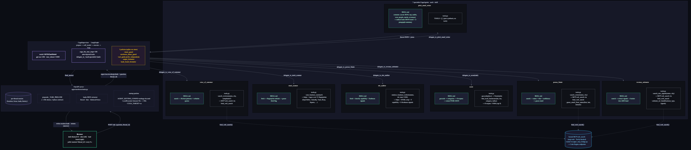

# Ouroboros — architecture

**Multi-agent CUGA app**: a `CugaSupervisor` orchestrates seven specialist
`CugaAgent`s, each backed by one declarative skill (`SKILL.md` + `tools.py`).
Specialists run in isolated planner contexts; the supervisor delegates and
the writer specialist consolidates everything into a ranked lead board.

For installation + run + troubleshooting, see [README.md](README.md).
This file is the architectural reference.

## Diagram



[architecture.png](architecture.png) · [architecture.svg](architecture.svg) ·
edit the source: [architecture.mmd](architecture.mmd) (Mermaid) and re-render with
`mmdc -i architecture.mmd -o architecture.png -w 2400 -H 1800 -b "#0b0d14"`.

## End-to-end flow (ASCII)

```
                                 ┌──────────────────────────────────────────────────────┐
                                 │              BROWSER  (left chat + right board)      │
                                 │                                                       │
                                 │   POST /ask {question, thread_id}                     │
                                 │   GET  /session/<thread_id>  (poll every 8s)          │
                                 └─────────────────────┬────────────────────────────────┘
                                                       │
                                                       ▼
┌────────────────────────────────────────────────────────────────────────────────────────────────┐
│                            FastAPI server  (apps/ouroboros/main.py)                            │
│                                                                                                │
│   • _sessions[thread_id] = {target_location, categories, pitch_focus, leads, history}          │
│   • prepends _TASK_PRELUDE (~1.4K-token 3-phase contract) to every user message                │
│   • parses writer's fenced ```json``` (or bare JSON, or balanced-brace fallback) into          │
│     session["leads"]                                                                            │
│   • monkey-patches LocalExecutor timeout floor → 180s                                          │
│   • sets AGENT_SETTING_CONFIG=settings.rits.toml at module top (before any cuga import)        │
└─────────────────────────────────────────────────────┬──────────────────────────────────────────┘
                                                      │ supervisor.invoke(prelude + question, thread_id)
                                                      ▼
┌────────────────────────────────────────────────────────────────────────────────────────────────┐
│                        CugaSupervisor   (LangGraph: prepare → call_model → execute → loop)     │
│                                                                                                │
│   • model:                  RITSChatModel(model_name="gpt-oss-120b", max_tokens=16000)         │
│   • cuga_lite_max_steps:    100                                                                 │
│   • Auto-injected tools:    delegate_to_<each-of-7-agents>(task: str) → str                    │
│   • Policies (shared sqlite-vec store at <sdk>/dbs/cuga.db):                                   │
│       intent_guard `ouroboros_abuse_guard`     — keyword-trigger refusal                       │
│       tool_guide   `prefer_independents`       — target_tools=[find_local_businesses]          │
│       output_formatter `leads_board_formatter` — keyword-trigger on writer's response          │
│                                                                                                │
│   The supervisor's planner reads the prelude as task instructions and writes Python code in    │
│   3 phases. Each delegate_to_<X>() returns a string that becomes a local variable.             │
└─────────────────────────────────────────────────────┬──────────────────────────────────────────┘
                                                      │ delegate_to_<specialist>(task) — A2A
            ┌─────────────────────┬───────────────────┼───────────────────┬─────────────────────┐
            ▼                     ▼                   ▼                   ▼                     ▼
┌──────────────────────┐  ┌───────────────────┐  ┌──────────────────┐  ┌────────────────┐  ┌──────────────────────┐
│ scout                │  │ site_auditor      │  │ voice_of_customer│  │ person_finder  │  │ stack_scanner        │
├──────────────────────┤  ├───────────────────┤  ├──────────────────┤  ├────────────────┤  ├──────────────────────┤
│ tools.py:            │  │ tools.py:         │  │ tools.py:        │  │ tools.py:      │  │ tools.py:            │
│  • geocode(place)    │  │  • analyze_       │  │  • search_       │  │  • search_     │  │  • scan_business_    │
│    → Nominatim       │  │    business_      │  │    reviews(      │  │    owner(name, │  │    stack(url)        │
│    {lat,lon,name}    │  │    website(name,  │  │    name, city,   │  │    city)       │  │    → httpx GET +     │
│                      │  │    url, max=1500) │  │    complaints?)  │  │    → MCP web_  │  │    regex over       │
│  • find_local_       │  │    → httpx GET +  │  │    → MCP web_    │  │    search via  │  │    33 third-party   │
│    businesses(       │  │    HTML strip +   │  │    search via    │  │    bind_       │  │    fingerprints     │
│    lat, lon,         │  │    9 capability + │  │    bind_web_     │  │    web_search  │  │    (OpenTable,      │
│    category,         │  │    8 freshness    │  │    search        │  │  • guess_      │  │    Calendly,        │
│    radius=4000)      │  │    signals        │  │                  │  │    email_from_ │  │    Toast, Resy,     │
│    → Overpass / OSM  │  │                   │  │                  │  │    name(first, │  │    Square, Stripe…) │
│                      │  │                   │  │                  │  │    last,       │  │                      │
│ SKILL.md:            │  │ SKILL.md:         │  │ SKILL.md:        │  │    domain)     │  │ SKILL.md:            │
│  geocode → categories│  │  fetch+classify → │  │  search → scan   │  │                │  │  fetch → fingerprint│
│  → Overpass → return │  │  return signals + │  │  for friction    │  │ SKILL.md:      │  │  → return third-    │
│  PURE JSON           │  │  text excerpt     │  │  patterns +      │  │  search →      │  │  parties + green-   │
│                      │  │                   │  │  verbatim quotes │  │  extract name+ │  │  field flag         │
│                      │  │                   │  │                  │  │  title+conf +  │  │                      │
│                      │  │                   │  │                  │  │  guess email   │  │                      │
└──────────┬───────────┘  └─────────┬─────────┘  └────────┬─────────┘  └───────┬────────┘  └──────────┬───────────┘
           │                        │                     │                    │                       │
           ▼                        ▼                     ▼                    ▼                       ▼
   ┌───────────────────────────────────────────────────────────────────────────────────────────────────┐
   │  Each specialist = a CugaAgent(model=…, tools=TOOLS_FROM_SKILL, special_instructions=SKILL.md)    │
   │  Each runs its own bounded CugaLite plan/execute graph in an isolated context.                    │
   │  Returns a string (their "answer") to the supervisor's runtime variable.                          │
   └───────────────────────────────────────────────────────────────────────────────────────────────────┘

      ┌────────────────────┐  ┌──────────────────────────────────────────────────────────────────────┐
      │ revenue_estimator  │  │ pitch_email_writer                                                   │
      ├────────────────────┤  ├──────────────────────────────────────────────────────────────────────┤
      │ tools.py:          │  │ tools.py:                                                            │
      │  • search_size_    │  │  TOOLS = []     (pure synthesis — no tools)                          │
      │    signals(name,   │  │                                                                      │
      │    city) → MCP     │  │ SKILL.md:                                                            │
      │    web_search via  │  │  receives consolidated context from the supervisor:                  │
      │    bind_web_search │  │    • full scout JSON (8 OSM hits)                                    │
      │  • estimate_arr_   │  │    • top candidates list                                             │
      │    band(business_  │  │    • audits[]   ← from site_auditor                                  │
      │    type, signals)  │  │    • vocs[]     ← from voice_of_customer                             │
      │    → vertical-     │  │    • people[]   ← from person_finder                                 │
      │    specific ARR    │  │    • stacks[]   ← from stack_scanner                                 │
      │    heuristic       │  │    • revenues[] ← from revenue_estimator                             │
      │                    │  │  produces: leads JSON board (location, lat, lon, summary, leads:    │
      │ SKILL.md:          │  │  [{name, fit_score, use_case, pitch, evidence, deep_dive,           │
      │  search → extract  │  │  website_signals, review_friction, person, stack, revenue_estimate, │
      │  signals → bucket  │  │  email_draft, …}], next_steps)                                      │
      │  into ARR band +   │  │                                                                      │
      │  confidence        │  │  + a 2-paragraph prose summary                                       │
      └────────────────────┘  └──────────────────────────────────────────────────────────────────────┘
```

## The 3-phase cascade (mandated by `_TASK_PRELUDE`)

```
┌──────────────────── Phase 1 ─────────────────────────────┐
│ Block A:  scout_result = await delegate_to_scout(task=Q) │
│           try:                                            │
│              data = json.loads(scout_result.strip())     │
│              candidates = data.get("candidates", []) or []│
│           except (JSONDecodeError, ValueError, ...):     │
│              data, candidates = {}, []                    │
│           top = candidates[:3]                            │
│           # Per-candidate enrichment dict — keyed by      │
│           # index so phase 3 NEVER zips parallel lists.   │
│           enrichments = {i: {"candidate": c}              │
│                          for i, c in enumerate(top)}      │
└────────────────────┬─────────────────────────────────────┘
                     │
                     ▼
┌────────────────────────── Phase 2 ─────────────────────────────────────┐
│ Each sweep WRITES into enrichments[i][<key>] for every candidate.      │
│ When a sweep skips a candidate (no website), it stores "" so the       │
│ slot still exists. By phase 3 every candidate has its full bundle.     │
│                                                                         │
│ Sweep 1: for i,c in enumerate(top): enrichments[i]["voc"]    = await voc(c)
│ Sweep 2: for i,c in enumerate(top): enrichments[i]["audit"]  = await audit(c)
│ Sweep 3: for i,c in enumerate(top): enrichments[i]["revenue"]= await rev(c)
│ Sweep 4: for i,c in enumerate(top): enrichments[i]["person"] = await person(c)
│ Sweep 5: for i,c in enumerate(top): enrichments[i]["stack"]  = await stack(c)
└────────────────────┬───────────────────────────────────────────────────┘
                     │
                     ▼
┌──────────────────── Phase 3 ─────────────────────────────────────────┐
│ enriched_list = [enrichments[i] for i in range(len(top))]              │
│ # one self-contained dict per top candidate, no positional alignment   │
│                                                                         │
│ writer_task = (                                                         │
│   "Build the final ranked lead board per your SKILL.md schema.\n\n"   │
│   f"Location: {json.dumps(location_obj)}\n\n"                         │
│   f"All scout candidates (use #4..N as preliminary, deep_dive=false): │
│     {json.dumps(candidates)}\n\n"                                       │
│   f"Enriched top {len(top)} (each dict carries audit/voc/revenue/      │
│     person/stack):\n{json.dumps(enriched_list)}\n\n"                   │
│   "REQUIREMENTS: deep_dive=true on top 3, fit_score is integer 1-10,   │
│   pitch is 60-150 words citing a concrete signal, email_draft has      │
│   non-empty subject AND body, lower-ranked leads get 1-2 sentence      │
│   pitch from OSM data alone, etc."                                     │
│ )                                                                     │
│ final = await delegate_to_pitch_email_writer(task=writer_task)        │
└────────────────────┬─────────────────────────────────────────────────┘
                     │
                     ▼
       writer's output = fenced JSON + 2-paragraph summary
                     │
                     ▼
       FastAPI parses JSON → session["leads"] → UI renders
```

## Per-agent fact sheet

| Agent | `description` (what supervisor's planner reads) | Native tools the agent uses internally | Pre-bind from MCP |
|---|---|---|---|
| `scout` | "Resolve a place name to coordinates and surface candidate local businesses by category from OpenStreetMap." | `geocode`, `find_local_businesses` | — |
| `site_auditor` | "Fetch a business website and classify it on capability gaps and freshness flaws." | `analyze_business_website` | — |
| `voice_of_customer` | "Mine review-site snippets and complaint posts for verbatim friction quotes about a specific business." | `search_reviews` | `web_search` |
| `person_finder` | "Find a likely decision-maker for a business and propose a best-guess direct email with a confidence rating." | `search_owner`, `guess_email_from_name` | `web_search` |
| `stack_scanner` | "Fingerprint third-party tools embedded on a business's website (OpenTable, Calendly, Toast, Square, Resy, Zocdoc, etc.)." | `scan_business_stack` | — |
| `revenue_estimator` | "Estimate the annual-revenue band of a business from public size signals." | `search_size_signals`, `estimate_arr_band` | `web_search` |
| `pitch_email_writer` | "Synthesize the final ranked lead board and a tailored cold email per deep-dived lead." | (none — pure synthesis) | — |

## MCP integration

Three specialists need `web_search` from the hosted MCP `mcp-web` server. Their
`tools.py` exposes a `bind_web_search(fn)` hook; `specialists.py` resolves
the MCP-loaded tool once at startup via `_mcp_bridge.load_tools(["web"])`
and calls each `bind_web_search(...)` with that coroutine. The skill never
imports MCP directly.

```
   apps/_mcp_bridge.py                 host bridge
        │
        ▼
   mcp-web (Code Engine)               Tavily-backed search tool
        ▲
        │ bind_web_search(coro)
        │
   skills/voice_of_customer/tools.py
   skills/person_finder/tools.py
   skills/revenue_estimator/tools.py
```

`_mcp_bridge.py` is shared with the rest of the `cuga-apps/apps/` stack;
URL resolution honors `CUGA_TARGET=ce` (default in `main.py`) to point at
the hosted Code Engine MCPs.

## CUGA capabilities tapped

| Capability | Where wired | What it gives us |
|---|---|---|
| **`CugaSupervisor`** | `main.py:make_supervisor` | A2A orchestration of 7 specialist agents |
| **`CugaAgent`** (×7) | `specialists.py:_make_agent` | Per-specialist plan/execute graph in isolated context |
| **`CugaLite` step caps** | `cuga_lite_max_steps=100` on supervisor | Bounded planner per agent, no runaway loops |
| **Skills (declarative)** | `skills/<name>/SKILL.md` | Specialist's body becomes `special_instructions` at startup |
| **Skills `tools.py`** | `skills/<name>/tools.py` → `TOOLS = [...]` | Native LangChain `@tool` wiring; dual-host CLI fallback |
| **Policies — `intent_guard`** | `main.py:_attach_policies` | Refuse harassment / doxxing intents, keyword-triggered |
| **Policies — `tool_guide`** | `main.py:_attach_policies` → `target_tools=["find_local_businesses"]` | Skip-chains nudge scoped to one tool only |
| **Policies — `output_formatter`** | `main.py:_attach_policies` → keyword on writer response | Enforce fenced JSON + 2-paragraph summary |
| **`policies.clear()`** | once at supervisor init | Process restarts don't accumulate stale policies |
| **MCP bridge integration** | `specialists.py:_resolve_web_search` + per-skill `bind_web_search` | 3 specialists pull from Tavily without leaking MCP into the skill |
| **Per-specialist `cuga_folder`** | `_DIR / .cuga_<skill_name>` | Per-specialist filesystem-sync of policies; skill artifacts isolated |

## SDK quirks worth knowing (collected the hard way)

These are non-obvious behaviors of the `feat/skills-support` CUGA branch
we discovered while building Ouroboros. Future apps on this branch should
factor them in.

1. **`CugaSupervisor.description=` is dead.** It's stored on `self._description`
   but never rendered into the supervisor's prompt template — the template
   hardcodes `special_instructions=None` (`cuga_supervisor_graph.py:379`).
   The only place to inject orchestration rules is the user-message itself
   (we prepend `_TASK_PRELUDE`).

2. **Internal CUGA nodes ignore the `model=` kwarg.** Each `CugaAgent`'s
   `model=` is used for the *outer* planner only. Sub-nodes (planner,
   shortlister, code-agent, answer, …) call `LLMManager().get_model(
   settings.agent.X.model)` directly, which reads from `AGENT_SETTING_CONFIG`'s
   TOML. So you must set `AGENT_SETTING_CONFIG` before *any* cuga import in
   the process — module-top, not inside `make_supervisor()`.

3. **The supervisor's code extractor is fragile to triple-backticks.**
   `extract_and_combine_codeblocks` uses `re.findall(r'```python(.*?)```',
   text, re.DOTALL)`. Non-greedy regex closes on the first `` ``` ``, so a
   regex literal like `r"```json...```"` *inside* the planner's code closes
   the fence early → block silently dropped → "no code, final answer"
   misclassification. Lesson: never put triple-backticks in the prelude or
   in any string the planner might quote.

4. **`LocalExecutor` hardcodes a 30s timeout** per code block
   (`code_executor.py:148`). Specialist CugaLite delegations regularly take
   30–60s, so we monkey-patch the timeout floor to 180s in `main.py`.

5. **Policy storage is a shared SQLite-vec DB at `<sdk>/dbs/cuga.db`** —
   adding the same policy from multiple agents in one process creates
   duplicates and persists across runs. We add each policy ONCE on a
   representative agent (intent_guard on writer, tool_guide on scout,
   output_formatter on writer) and call `policies.clear()` at startup.

6. **`platform == "rits"` in CUGA's `LLMManager` instantiates `ChatOpenAI`
   with the toml's `url`** (default `http://localhost:4000`). That expects a
   LiteLLM proxy at :4000 to rewrite OpenAI's `Bearer <key>` into RITS's
   `RITS_API_KEY: <key>`. Without the proxy, internal CUGA calls 401/403.

7. **Scout's CugaLite-generated answer can truncate.** Without a
   `max_tokens` cap, RITS prod defaults to a low limit (~1024 tokens). We
   set `RITSChatModel.max_tokens=16000` and pin it in the payload (`_llm.py`).

8. **`auto_load_policies` and `reset_policy_storage` interact** — the
   storage clear happens BEFORE filesystem auto-load, so policies on disk
   come back unless you `auto_load_policies=False` on every agent. We do.

9. **`Items: 222` in the supervisor's variable summary = `len(string)`** —
   it's the actual stored value's length, not a preview cap. If a specialist
   returns 222 chars, that's what subsequent blocks see.

10. **The supervisor's prompt template enforces "one delegation per code
    block"** in prose, but the framework actually combines all `​```python```
    blocks in one model response and runs them as one script. Multi-block
    responses are fine; variables flow naturally between them.

## Repo layout

```
apps/ouroboros/
├── main.py                  FastAPI server, CugaSupervisor build, policy attach,
│                            _TASK_PRELUDE, json extractor, executor monkey-patch
├── specialists.py           7 factories: each loads one skill into a CugaAgent
├── ui.py                    dark two-panel UI (chat + lead board + email modal)
├── diag.py                  one-shot end-to-end diagnostic (dumps full trace)
├── README.md                install, run, troubleshoot — start here
├── ARCHITECTURE.md          this file — design + agents + cascade + quirks
├── requirements.txt         dependency hints (cuga is a path install)
└── skills/                  the seven specialists' artifacts
    ├── scout/               geocode + Overpass
    │   ├── SKILL.md
    │   └── tools.py
    ├── site_auditor/        capability + freshness signal classifier
    ├── voice_of_customer/   web_search → friction quotes
    ├── person_finder/       owner search + email pattern guesses
    ├── stack_scanner/       OpenTable / Calendly / Toast / etc fingerprint
    ├── revenue_estimator/   size signals → coarse ARR band
    └── pitch_email_writer/  no tools — synthesis from collected signals
```

After first run, you'll also see seven `.cuga_<specialist>/` directories
under `apps/ouroboros/`. Those are CUGA's per-agent filesystem-sync of
attached policies. Safe to delete; they're regenerated on next start.

## Outstanding rough edges

The cascade now completes end-to-end and produces an 8-lead board. The
biggest historical failure mode (parallel-list alignment) was fixed by
moving to per-candidate enrichment bundles (the `enrichments` dict
above). One known soft spot remains:

- **The supervisor's planner sometimes runs only one specialist sweep
  before jumping to the writer.** The "do all 5 sweeps" rule is in the
  prelude but doesn't always stick on gpt-oss-120b. Mitigation already
  in place: bundle pattern means even a partial sweep produces a usable
  bundle. If reliability degrades further, the next step is to drive
  the supervisor in three separate `/ask` invocations from main.py
  (one per phase) so the planner sees a smaller decision space per
  call — keeps multi-agent intact, just moves the `for phase in [1,2,3]`
  loop out of the LLM and into Python.
